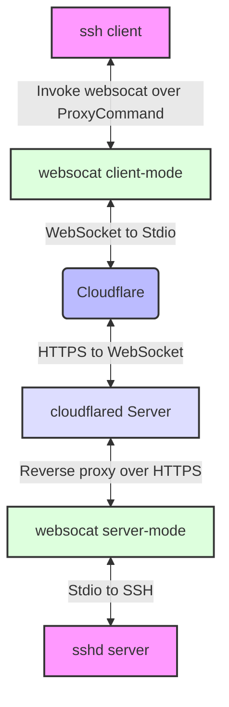

# 0-effort way to temporarily expose ssh over cloudflare

Explanation: https://taras.glek.net/post/cloudflare-ssh/

```
docker compose up
```

Given a log message from cloudflare like:
```
2024-03-08 12:21:36.757	
2024-03-08T10:21:36Z INF +--------------------------------------------------------------------------------------------+
2024-03-08 12:21:36.757	
2024-03-08T10:21:36Z INF |  https://library-won-nt-gauge.trycloudflare.com                                            |
2024-03-08 12:21:36.757	
2024-03-08T10:21:36Z INF |  Your quick Tunnel has been created! Visit it at (it may take some time to be reachable):  |
2024-03-08 12:21:36.756	
2024-03-08T10:21:36Z INF +--------------------------------------------------------------------------------------------+
```

You can now login via:

```
ssh -o ProxyCommand="websocat -E --binary - -v ws://%h" -o ServerAliveInterval=10 library-won-nt-gauge.trycloudflare.com
```

# Architecture


